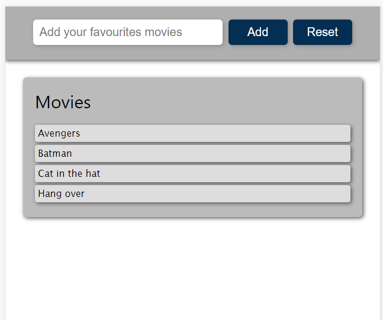

# This programm shows you how to use LOCALSTORAGE in your aplications so simply 

> Just type a movie and then by clicking inspect (GOOGLE CHROME), you can check out how many elements have been added up to the local memory.
>
> By clicking button RESET, is so easy to erase all data by using
>
> `localStorage.clear()`

